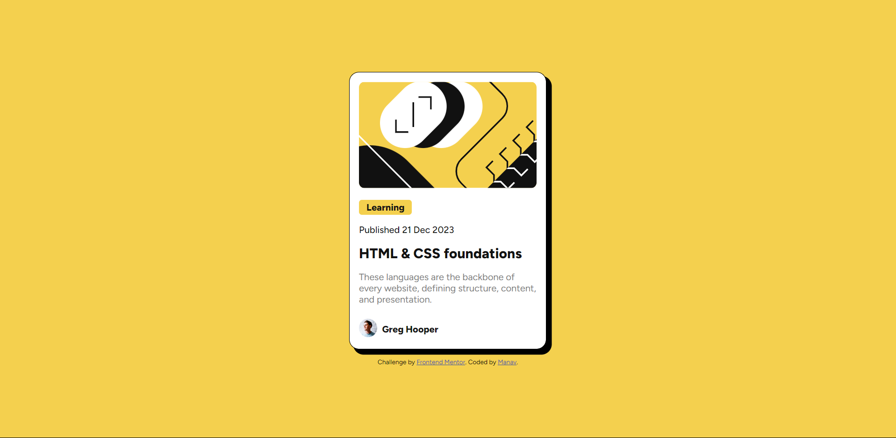

# Frontend Mentor - Blog preview card solution

This is a solution to the [Blog preview card challenge on Frontend Mentor](https://www.frontendmentor.io/challenges/blog-preview-card-ckPaj01IcS). Frontend Mentor challenges help you improve your coding skills by building realistic projects. 

## Table of contents

- [Overview](#overview)
  - [The challenge](#the-challenge)
  - [Screenshot](#screenshot)
  - [Links](#links)
- [My process](#my-process)
  - [Built with](#built-with)
  - [What I learned](#what-i-learned)
  - [Continued development](#continued-development)
  - [Useful resources](#useful-resources)
- [Author](#author)

## Overview
In this project I made a blog preview card using HTML5 and CSS3.

### The challenge

Users should be able to:

- See active state for all interactive elements on the page
- access the webpage on all devices (responsive design)

### Screenshot

### Links

- Solution URL: [Add solution URL here](https://your-solution-url.com)
- Live Site URL: [Add live site URL here](https://your-live-site-url.com)

## My process
I wrote the HTML markup and then styled it with CSS. 

### Built with

- Semantic HTML5 markup
- CSS custom properties
- Flexbox
- Mobile-first workflow

### What I learned

I learned a lot about accessibility and semantic markup writing. 

### Continued development

I am going to focus on responsive web design along with following the accessibility guidelines to the best of my knowledge.

### Useful resources

- [Convert pixels to rems ](https://nekocalc.com/px-to-rem-converter) - This helped me in conversion of px units to rems. I look forward to using more and more relative units in my design to improve responsivenss.
- [HTML: A good basis for accessibility](https://developer.mozilla.org/en-US/docs/Learn/Accessibility/HTML) - This is an amazing article which helped me deepen my understanding on semantic markup. I'd recommend it to anyone still learning this concept. Other than that MDN's article on the Time element also helped.
- [Google's Gemini](https://gemini.google.com/?hl=en) - Google's Gemini (AI Assitant) helped in writing the markup. I referenced MDN's article (listed above) and wrote my markup first. Then I interacted with Gemini while still referencing the MDN's article. 

## Author

- Frontend Mentor - [@manav-sharma69](https://www.frontendmentor.io/profile/manav-sharma69)
