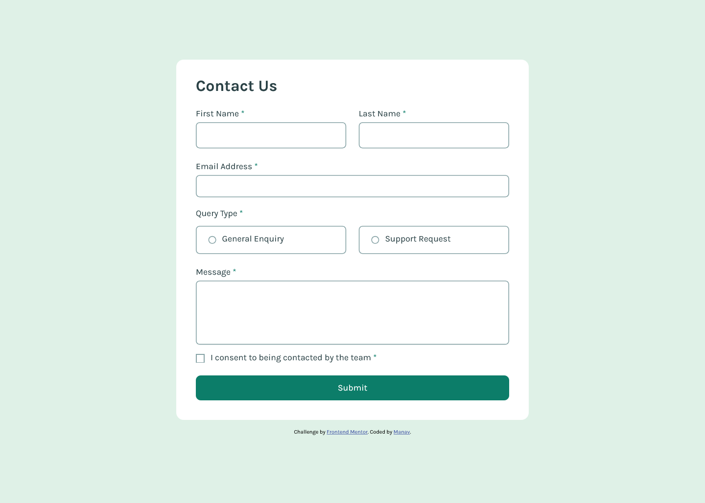

# Frontend Mentor - Contact form solution

This is a solution to the [Contact form challenge on Frontend Mentor](https://www.frontendmentor.io/challenges/contact-form--G-hYlqKJj). Frontend Mentor challenges help you improve your coding skills by building realistic projects. 

## Table of contents

- [Overview](#overview)
  - [The challenge](#the-challenge)
  - [Screenshot](#screenshot)
  - [Links](#links)
- [My process](#my-process)
  - [Built with](#built-with)
  - [What I learned](#what-i-learned)
  - [Continued development](#continued-development)
  - [Useful resources](#useful-resources)
- [Author](#author)
- [Acknowledgments](#acknowledgments)

## Overview

### The challenge

Users should be able to:

- Complete the form and see a success toast message upon successful submission
- Receive form validation messages if:
  - A required field has been missed
  - The email address is not formatted correctly
- Complete the form only using their keyboard
- Have inputs, error messages, and the success message announced on their screen reader
- View the optimal layout for the interface depending on their device's screen size
- See hover and focus states for all interactive elements on the page

### Screenshot

### Links

- Solution URL: [GitHub Repo](https://github.com/manav-sharma69/frontend-mentor-projects/tree/main/contact-form-main)
- Live Site URL: [GitHub Pages](https://manav-sharma69.github.io/frontend-mentor-projects/contact-form-main/index.html)

## My process

### Built with

- Semantic HTML5 markup
- CSS custom properties
- Flexbox
- CSS Grid
- Mobile-first workflow

### What I learned

How to make an accessible form whose all contents (visible text to dynamic warnings) are readable. Also, I learnt how to do client side validation with the screen reader's behaviour in mind.

### Continued development

Need to learn more on ARIA attributes and `role=""` attributes. Ex: Windows Narrator reads out all the contents of the flash message when form is opened in Firefox but in Brave (and possibly other Chromium browsers) it just reads the first line.

## Author

- Frontend Mentor - [@yourusername](https://www.frontendmentor.io/profile/manav-sharma69)