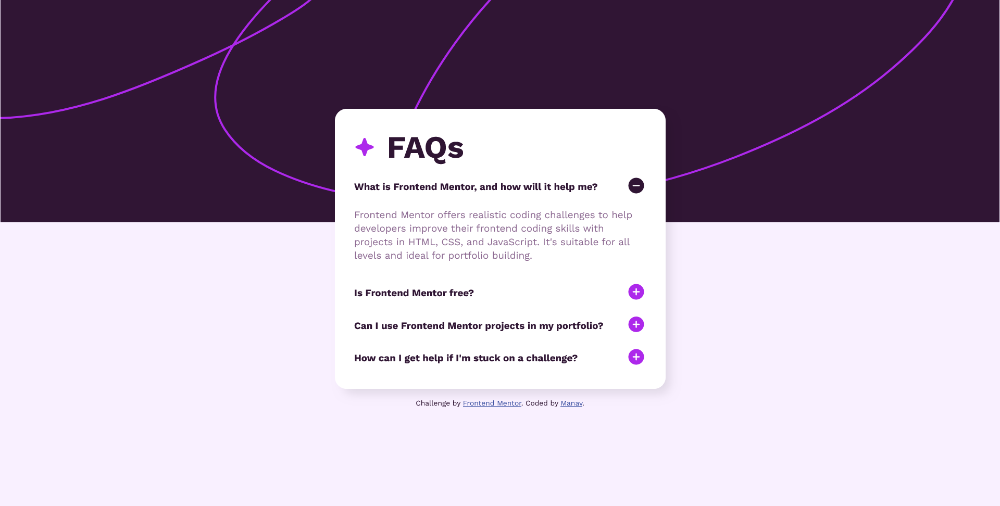

# Frontend Mentor - FAQ accordion solution

This is a solution to the [FAQ accordion challenge on Frontend Mentor](https://www.frontendmentor.io/challenges/faq-accordion-wyfFdeBwBz). Frontend Mentor challenges help you improve your coding skills by building realistic projects. 

## Table of contents

- [Overview](#overview)
  - [The challenge](#the-challenge)
  - [Screenshot](#screenshot)
  - [Links](#links)
- [My process](#my-process)
  - [Built with](#built-with)
  - [What I learned](#what-i-learned)
  - [Continued development](#continued-development)
  - [Useful resources](#useful-resources)
- [Author](#author)
- [Acknowledgments](#acknowledgments)

## Overview

### The challenge

The challenge is to build out the FAQ accordion and get it looking as close to the design as possible.

Users should be able to:

- Hide/Show the answer to a question when the question is clicked
- Navigate the questions and hide/show answers using keyboard navigation alone
- View the optimal layout for the interface depending on their device's screen size
- See hover and focus states for all interactive elements on the page

### Screenshot

### Links

- Solution URL: [GitHub Repo](https://github.com/manav-sharma69/frontend-mentor-projects/tree/main/faq-accordion-main)
- Live Site URL: [GitHub Pages](https://manav-sharma69.github.io/frontend-mentor-projects/faq-accordion-main/index.html)

## My process
I started looking for the appropriate semantic markup for an accordion. Eventually I ended up on the `
` element - thanks to Gemini! Then 

### Built with

- Semantic HTML5 markup
- CSS custom properties
- Flexbox
- CSS Grid
- Mobile-first workflow

### What I learned

I learned
- about `
` element and that it's `name` attribute is not supported in `Firefox` browsers.
- to work with background images
- about and used the media query `any-pointer` and that `hover` pseudo class might be used less ([Are Hovers Events extinct?](https://designshack.net/articles/css/are-hover-events-extinct/))
- about when to use `<dl>` element and `<ul>` element (eventually ended up using `
`)

### Continued development

Want to learn more about HTML and how layouts can be impacted even with little properties. 

I spent hours trying to fix my layout and the fix was to set `list-style: none;` for the `
` element. If you don't do it, then on smaller viewports you'll have scrollbar and crawlbar (something that I hate - maybe). 

I also want to improve my skills on working with images of all kinds - responsive, background, inside container as a background, in short, everywhere image can be present be as logo, icon, background, anything. IT SHOULD WORK!! 

### Useful resources

- [`
`: The Details disclosure element (MDN)](https://developer.mozilla.org/en-US/docs/Web/HTML/Element/details) - The main highlight of this project. Helps you make semantic accordion without JS!
- [implement 
 attribute (exclusive accordion)](https://bugzilla.mozilla.org/show_bug.cgi?id=1856460) - Link to Mozilla's bug with `name` attribute in `
` element.
- [`<picture>`: The Picture element (MDN)](https://developer.mozilla.org/en-US/docs/Web/HTML/Element/picture) - This is what I was originally going to use instead of background image (because I knew about the `srcset` attribute).
- [CSS: background image on background color (Stackoverflow)](https://stackoverflow.com/questions/8195215/css-background-image-on-background-color) - This helped me improve my background image's CSS (mine was also working, but I ended up using this one I guess)
- [any-pointer (MDN)](https://developer.mozilla.org/en-US/docs/Web/CSS/@media/any-pointer) - The `any-pointer` media query.

## Author

- Frontend Mentor - [@manav-sharma69](https://www.frontendmentor.io/profile/manav-sharma69)
