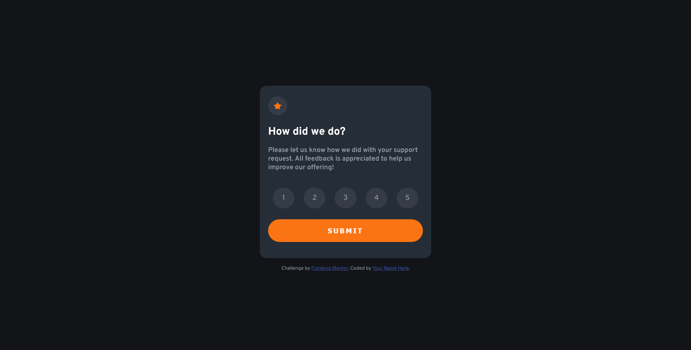

# Frontend Mentor - Interactive rating component solution

This is a solution to the [Interactive rating component challenge on Frontend Mentor](https://www.frontendmentor.io/challenges/interactive-rating-component-koxpeBUmI). Frontend Mentor challenges help you improve your coding skills by building realistic projects. 

## Table of contents

- [Overview](#overview)
  - [The challenge](#the-challenge)
  - [Screenshot](#screenshot)
  - [Links](#links)
- [My process](#my-process)
  - [Built with](#built-with)
  - [What I learned](#what-i-learned)
  - [Continued development](#continued-development)
  - [Useful resources](#useful-resources)
- [Author](#author)

## Overview

### The challenge

Users should be able to:

- View the optimal layout for the app depending on their device's screen size
- See hover states for all interactive elements on the page
- Select and submit a number rating
- See the "Thank you" card state after submitting a rating

### Screenshot

### Links

- Solution URL: [GitHub Repo](https://github.com/manav-sharma69/frontend-mentor-projects/tree/main/interactive-rating-component-main)
- Live Site URL: [GitHub Pages](https://manav-sharma69.github.io/frontend-mentor-projects/interactive-rating-component-main/index.html)

## My process

- started with HTML
- then wrote CSS
- finally JS
- searching the web the whole time for differernt solutions to the problems I faced

### Built with

- Semantic HTML5 markup
- CSS custom properties
- Flexbox
- CSS Grid
- Mobile-first workflow

### What I learned

The `:checked` pseudo class behaves wierdly (or maybe it's the `~` sibling selector).

### Continued development

Learn how to keep shapes responsive. (Struggled with keeping circles from turning into ovals!)

### Useful resources

- [How to Change Label when Radio Button Checked in Tailwind CSS ?](https://www.geeksforgeeks.org/how-to-change-label-when-radio-button-checked-in-tailwind-css/) - The solution uses CSS3 and not Tailwind. This finally helped me to set styling on `<label>` when `<input>` was checked (although I initially wanted do something else - next link).
- [`:checked` pseudo class does not style sibling `` element if input is nested inside the label](https://stackoverflow.com/q/78496841/22045800) - The `:checked` pseudo class behaves wierdly (or maybe it's the `~` sibling selector).
- [appearance (MDN)](https://developer.mozilla.org/en-US/docs/Web/CSS/appearance) - Use this property to hide input element from visibility but not from the accessibility tree.

## Author

- Frontend Mentor - [@manav-sharma69](https://www.frontendmentor.io/profile/manav-sharma69)