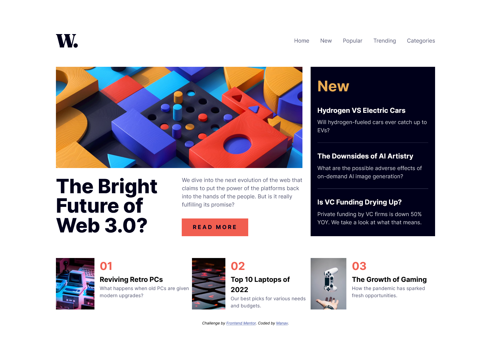

# Frontend Mentor - News homepage solution

This is a solution to the [News homepage challenge on Frontend Mentor](https://www.frontendmentor.io/challenges/news-homepage-H6SWTa1MFl). Frontend Mentor challenges help you improve your coding skills by building realistic projects. 

## Table of contents

- [Overview](#overview)
  - [The challenge](#the-challenge)
  - [Screenshot](#screenshot)
  - [Links](#links)
- [My process](#my-process)
  - [Built with](#built-with)
  - [What I learned](#what-i-learned)
  - [Continued development](#continued-development)
  - [Useful resources](#useful-resources)
- [Author](#author)
- [Acknowledgments](#acknowledgments)

## Overview

### The challenge

Users should be able to:

- View the optimal layout for the interface depending on their device's screen size
- See hover and focus states for all interactive elements on the page

### Screenshot

### Links

- Solution URL: [GitHub Repo](https://github.com/manav-sharma69/frontend-mentor-projects/tree/main/news-homepage-main)
- Live Site URL: [GitHub Pages](https://manav-sharma69.github.io/frontend-mentor-projects/news-homepage-main/index.html)

## My process
- added custom style for tab sized viewport

### Built with

- Semantic HTML5 markup
- CSS custom properties
- Flexbox
- CSS Grid
- Mobile-first workflow

### What I learned

- learned how to make an accordion
- practice grid layout

### Continued development

Learn to 
- write shorter & better CSS
- style more precisely

## Author

- Frontend Mentor - [@manav-sharma69](https://www.frontendmentor.io/profile/manav-sharma69)