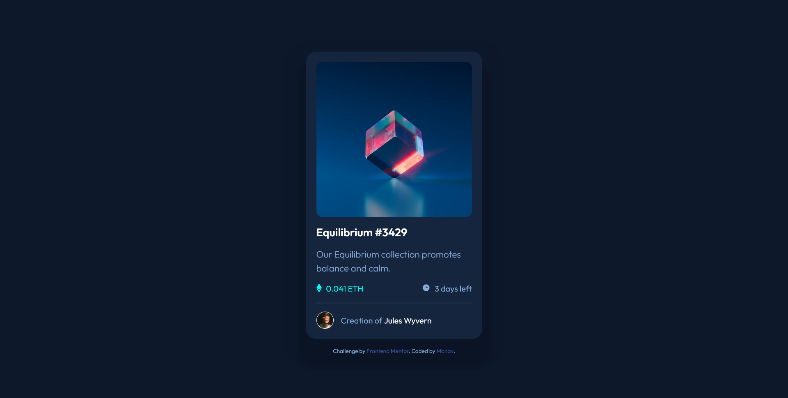

# Frontend Mentor - NFT preview card component solution

This is a solution to the [NFT preview card component challenge on Frontend Mentor](https://www.frontendmentor.io/challenges/nft-preview-card-component-SbdUL_w0U). Frontend Mentor challenges help you improve your coding skills by building realistic projects. 

## Table of contents

- [Overview](#overview)
  - [The challenge](#the-challenge)
  - [Screenshot](#screenshot)
  - [Links](#links)
- [My process](#my-process)
  - [Built with](#built-with)
  - [What I learned](#what-i-learned)
  - [Continued development](#continued-development)
  - [Useful resources](#useful-resources)
- [Author](#author)

## Overview

### The challenge

Users should be able to:

- View the optimal layout depending on their device's screen size
- See hover states for interactive elements

### Screenshot

### Links

- Solution URL: [GitHub Repo](https://github.com/manav-sharma69/frontend-mentor-projects/tree/main/nft-preview-card-component-main)
- Live Site URL: [GitHub Pages](https://manav-sharma69.github.io/frontend-mentor-projects/nft-preview-card-component-main/index.html)

## My process

- started with HTML
- then wrote CSS
- searching the web the whole time for differernt solutions to the problems I faced

### Built with

- Semantic HTML5 markup
- CSS custom properties
- Flexbox
- CSS Grid
- Mobile-first workflow

### What I learned

How to create image overlays. The key is to use `inset` property when doing overlays on not the whole page.

### Continued development

Practice more overlaying with CSS as and when needed.

### Useful resources

- [Image overlay example (Codepen.io)](https://codepen.io/ibaslogic/pen/yLEPeXm) - In this example, overlay 5 helped me to complete the challenge. (I got the idea of adding another element and playing with its `position` from Stackoverflow)
- [<figure>: The Figure with Optional Caption element (MDN)](https://developer.mozilla.org/en-US/docs/Web/HTML/Element/figure) - Used `<figure>` instead of wrapping everything in `<article>`. 

## Author

- Frontend Mentor - [@manav-sharma69](https://www.frontendmentor.io/profile/manav-sharma69)
