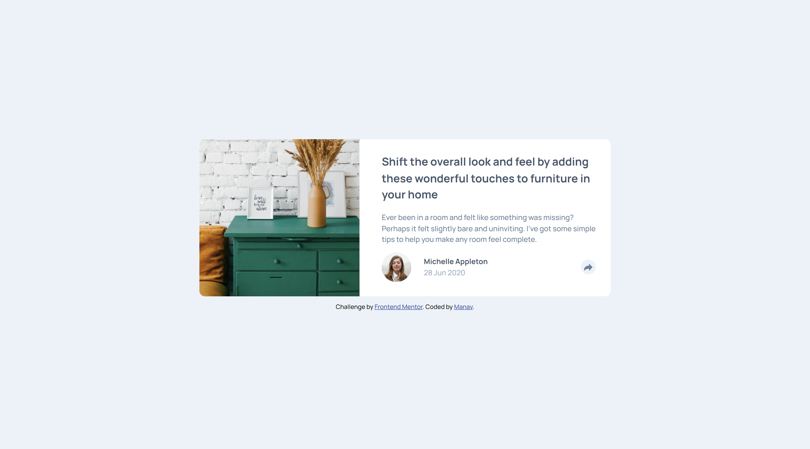

# Frontend Mentor - Article preview component solution

This is a solution to the [Article preview component challenge on Frontend Mentor](https://www.frontendmentor.io/challenges/article-preview-component-dYBN_pYFT). Frontend Mentor challenges help you improve your coding skills by building realistic projects. 

## Table of contents

- [Overview](#overview)
  - [The challenge](#the-challenge)
  - [Screenshot](#screenshot)
  - [Links](#links)
- [My process](#my-process)
  - [Built with](#built-with)
  - [What I learned](#what-i-learned)
  - [Continued development](#continued-development)
  - [Useful resources](#useful-resources)
- [Author](#author)

## Overview

### The challenge

Users should be able to:

- View the optimal layout for the component depending on their device's screen size
- See the social media share links when they click the share icon

### Screenshot

### Links

- Solution URL: [GitHub Repo](https://github.com/manav-sharma69/frontend-mentor-projects/tree/main/article-preview-component-main)
- Live Site URL: [GitHub Pages](https://manav-sharma69.github.io/frontend-mentor-projects/article-preview-component-main/index.html)

## My process
- Doing as much as I can on my own
- Researching for right approach, and applying them!

### Built with

- Semantic HTML5 markup
- CSS custom properties
- Flexbox
- CSS Grid
- Mobile-first workflow

### What I learned

- learned about the `setProperty()` JS method
- learned how to change SVG's color dynamically
- Learned how to make a UI component - the message box || speech bubble || popup || tooltip (made it the first time, it's a bit hacky, stuggled with it a lot 😅)
- made triangle using CSS

### Continued development

- design more new UI components like this one

### Useful resources

- [Element: className property (MDN)](https://developer.mozilla.org/en-US/docs/Web/API/Element/className) - Used to check if shareBox is hidden or visible and hide the triangle accordingly.
- [CSSStyleDeclaration: setProperty() method (MDN)](https://developer.mozilla.org/en-US/docs/Web/API/CSSStyleDeclaration/setProperty) 
- [Styling a CSS pseudo-element with JavaScript](https://cassidoo.co/post/styling-css-pseudo/) - Change properties of pseudo elements via JS. Used it to learn how to hide that arrow (triangle below the share links box)
- [CSS Triangle (CSS Tricks)](https://css-tricks.com/snippets/css/css-triangle/) - Make triangle using CSS
- [Speech bubble with arrow (StackOverflow)](https://stackoverflow.com/a/30299094/22045800) - Didn't read the complete soln 
- [How can I change the color of an 'svg' element? (StackOverflow)](https://stackoverflow.com/a/65147574/22045800) - Change SVG element's color dynamically

## Author

- Frontend Mentor - [@manav-sharma69](https://www.frontendmentor.io/profile/manav-sharma69)