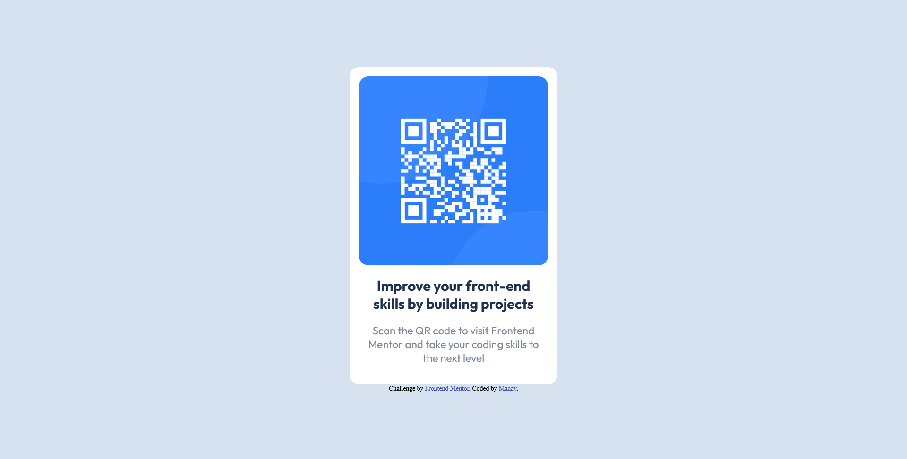

# Frontend Mentor - QR code component solution

This is a solution to the [QR code component challenge on Frontend Mentor](https://www.frontendmentor.io/challenges/qr-code-component-iux_sIO_H). Frontend Mentor challenges help you improve your coding skills by building realistic projects. 

## Table of contents

- [Overview](#overview)
  - [Screenshot](#screenshot)
  - [Links](#links)
- [My process](#my-process)
  - [Built with](#built-with)
  - [What I learned](#what-i-learned)
  - [Continued development](#continued-development)
  - [Useful resources](#useful-resources)
- [Author](#author)
- [Acknowledgments](#acknowledgments)

**Note: Delete this note and update the table of contents based on what sections you keep.**

## Overview

My first Frontend Mentor Project!

### Screenshot

### Links

- Solution URL: [GitHub Repo](https://github.com/manav-sharma69/frontend-mentor-projects/tree/main/qr-code-component)
- Live Site URL: [GitHub Pages](https://manav-sharma69.github.io/frontend-mentor-projects/qr-code-component/index.html)

## My process

It is a simple card component. So, that's what I did. I just put my image and text (paragraph tag) inside a div and styled it. I set the card's max width to be 320px to meet WCAG guidelines. Typography and color instructions were provided in a styles markdown file.  

### Built with

- Semantic HTML5 markup
- CSS custom properties
- Flexbox
- Mobile-first workflow

### What I learned

I learned about the WCAG guidelines regarding responsiveness.

### Continued development

I would like to continue learning more about Accessibility.

### Useful resources

- [BOIA](https://www.boia.org/blog/does-wcag-2.1-require-responsive-design) - This helped me to gain knowledge aboout the WCAG requirements related to responsive website.
- [Official WCAG](https://www.w3.org/TR/WCAG21/) - The official site of WCAG. 

## Author

- Frontend Mentor - [@manav-sharma69](https://www.frontendmentor.io/profile/manav-sharma69)
