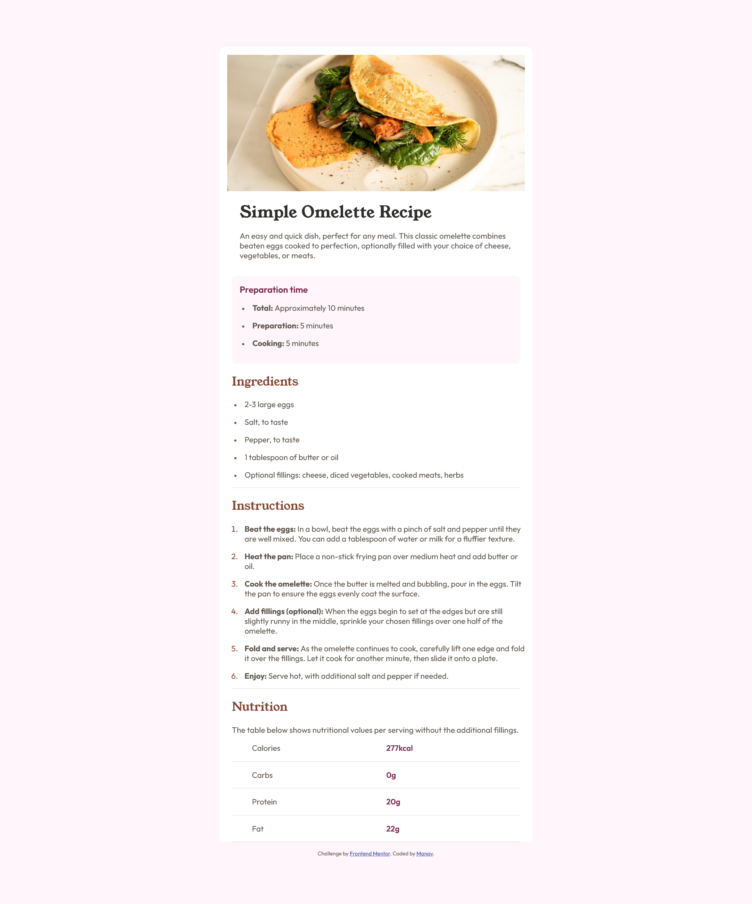

# Frontend Mentor - Recipe page solution

This is a solution to the [Recipe page challenge on Frontend Mentor](https://www.frontendmentor.io/challenges/recipe-page-KiTsR8QQKm). Frontend Mentor challenges help you improve your coding skills by building realistic projects. 

## Table of contents

- [Overview](#overview)
  - [The challenge](#the-challenge)
  - [Screenshot](#screenshot)
  - [Links](#links)
- [My process](#my-process)
  - [Built with](#built-with)
  - [What I learned](#what-i-learned)
  - [Continued development](#continued-development)
  - [Useful resources](#useful-resources)
- [Author](#author)
- [Acknowledgments](#acknowledgments)

## Overview

A responsive page for Simple Omelette Recipe. The webpage should be accessible and responsive.

### Screenshot

### Links

- Solution URL: [GitHub Repo](https://github.com/manav-sharma69/frontend-mentor-projects/tree/main/recipe-page-main)
- Live Site URL: [GitHub Pages](https://manav-sharma69.github.io/frontend-mentor-projects/recipe-page-main/index.html)

## My process
I started with mobile layout first. Then I added some media queries for `min-width: 425px`. I chose 425px cuz this was the width of large size mobile devices in my dev tools.

### Built with

- Semantic HTML5 markup
- CSS custom properties
- Flexbox
- Mobile-first workflow

### What I learned

I increased my understanding on writing proper, semantic HTML markup. 

### Continued development

Practice designing webpages in mobile first workflow. Because I was trying to design the webpage based only on images, it took me longer than expected. But after writing the CSS for mobile view, changing it for larger screens was not more than 20-25 lines of CSS.

### Useful resources

- [MDN as always](https://developer.mozilla.org/en-US/docs/Web/HTML/Element) - This is a page on MDN's site which lists probably all HTML elements and gives a general idea about their usage. I referenced this page to write my markup.
- [Stack Overflow](https://stackoverflow.com/questions/4373046/css-control-space-between-bullet-and-li) - I used it cuz I didn't knew how to add spacing between an `li`'s content and its marker. (I thought that it could be done by using CSS alone without making any changes to the markup).

## Author

- Frontend Mentor - [@manav-sharma69](https://www.frontendmentor.io/profile/manav-sharma69)

## Acknowledgments

Mr. commented on my last [blog preview card project](https://github.com/manav-sharma69/frontend-mentor-projects/tree/main/blog-preview-card-main) and I learned from him about the `<figure>` tag. That was helpful.